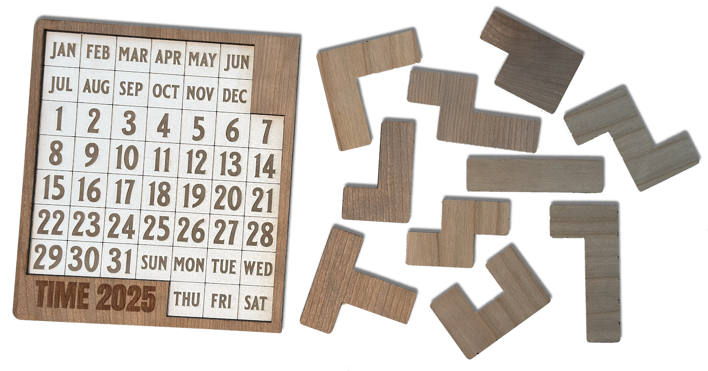
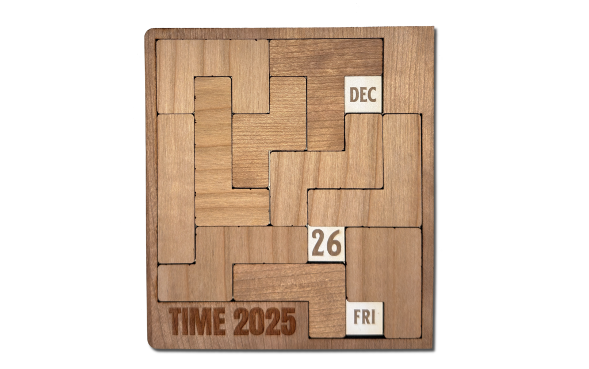

# Day-of-the-Year (DOTY) Puzzle Solver

A solver for the Day-of-the-Year calendar puzzle.

## Overview

This solver is written in Python as an exercise in **literate programming** and **SAT-based** problem modeling and solving. It reduces the problem in polynomial time and space to a propositional formula, then uses a SAT solver to tackle the hard part of the puzzle.

For more information about how the solver works see [this technical overview](./DayOfTheYear.md).

The code [is here](./DayOfTheYear.py).  **No AI assistant** has been used to develop this software.

### Requirements

- Python 3.6+
- [PySAT](https://pysathq.github.io/) library with [CaDiCaL](https://github.com/arminbiere/cadical) solver

### Installation

```bash
# Clone the repository
git clone https://github.com/mabene/doty.git
cd doty

# Install dependencies
pip install -r requirements.txt
```


## The Puzzle

The DOTY puzzle is played on a board (left) containing all months, days (1-31), and weekdays, using 10 [*polyomino* pieces](https://en.wikipedia.org/wiki/Polyomino) (right):





**Goal**: Place all 10 pieces on the board (rotations and flips allowed) so that exactly 3 cells remain visible, representing a target date (month, day number, weekday).

For example, if you target the date "**Friday, December 26**", then a possible solution is as follows.


## Script usage

### Basic Usage

```bash
# Solve for today's date
./DayOfTheYear.py

# Solve for a specific date
./DayOfTheYear.py Mon Jan 1
./DayOfTheYear.py "Friday, December 26"
./DayOfTheYear.py SAT OCT 25
```

### Example Output

```
Target date: SAT OCT 25
┏━━━━━━━┳━━━━━━━┳━━━┳━━━┓
┃       ┃       ┃   ┃   ┃
┃       ┃   ┏━━━┫   ┃   ┃
┃       ┃   ┃OCT┃   ┃   ┃
┃   ┏━━━┛   ┣━━━┫   ┃   ┗━━━┓
┃   ┃       ┃   ┃   ┃       ┃
┣━━━┻━━━┳━━━┛   ┃   ┣━━━━━━━┫
┃       ┃       ┃   ┃       ┃
┃   ┏━━━┫   ┏━━━┻━━━┻━━━┓   ┃
┃   ┃   ┃   ┃           ┃   ┃
┃   ┃   ┃   ┣━━━┓   ┏━━━┛   ┃
┃   ┃   ┃   ┃ 25┃   ┃       ┃
┃   ┃   ┗━━━┻━━━┫   ┣━━━━━━━┫
┃   ┃           ┃   ┃       ┃
┗━━━┻━━━━━━━━━━━╋━━━┛   ┏━━━┫
                ┃       ┃SAT┃
                ┗━━━━━━━┻━━━┛
```

### Options

```bash
# Show help
./DayOfTheYear.py -h

# Count all solutions for a date
./DayOfTheYear.py -count Mon Jan 1

# Show all solutions (could be thousands!)
./DayOfTheYear.py -count -show Fri Dec 25

# Verbose mode (show formula statistics and timing)
./DayOfTheYear.py -v

# Export SAT instance to DIMACS format
./DayOfTheYear.py -dump Sat Oct 25
```

## License

Copyright © 2025 Marco Benedetti

Permission to use, copy, modify, and/or distribute this software for non-commercial academic purposes, with or without modification, is hereby granted, provided that attribution is maintained.

This software is provided "as is," without warranty of any kind. See the script header for full license terms.

## Author

**Marco Benedetti**
[LinkedIn](https://www.linkedin.com/in/marco-benedetti-art)

---

## Acknowledgments

- The SAT solving community for developing powerful tools like CaDiCaL
- The PySAT framework for providing excellent Python bindings
- The puzzle creators for designing an elegant combinatorial challenge
